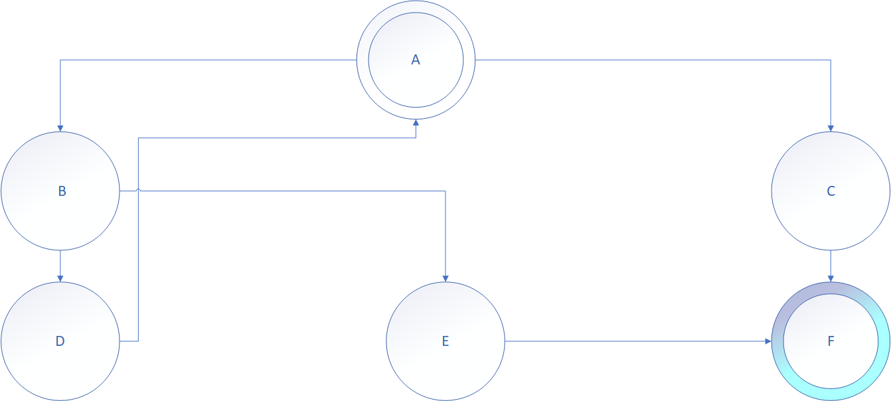

# 深度优先搜索 #

---

[toc]

---

---

## 一、算法介绍 ##

> 深度优先搜索属于图算法的一种, 其过程简要来说就是对每一个可能的分支路径深入到不能深入位置, 同时每个节点只能访问一次

### 步骤 ###

1. 以深度为准则, 沿一条路走到底, 直到达到目标
2. 如果尚未达到目标, 就已经无路可走(没有连通的节点), 那么退回到上一步的状态走其他路

### 实现 ###

- 栈: 因为我们每次搜索到一个新的节点, 我们都立即对这个节点进行判断, 所以采用LIFO的栈进行遍历
- 也可以通过与 栈 等价的递归实现

### 示例 ###

​	我们从节点A出发, 要求通过遍历搜索到节点F

​	使用栈 : 下文中的方向选择是任意的, 实际情形中, 我们并不知道哪条路可以找到目标节点, 但是我们始终需要将一个方向走到底, 即栈顶节点不能走到新的节点为止

- 节点A进栈, 栈顶为节点A
    - 选择一个方向例如节点B进栈, 栈顶为节点B
        - 选择一个方向例如节点D进栈
            - 此时节点D只有一个指向节点A的方向, 但是节点A我们已经遍历过, 所以不会有新的节点进栈, 于是进行出栈操作
        - 将节点D出栈, 栈顶为节点B
        - 节点B还有指向节点E的路径,将节点E进栈, 栈顶节点为E
            - 节点E 还有指向节点F的路径, 将节点F进栈, 栈顶节点为F
                - 节点F没有指向其他节点的路径, 所以不会有新的节点进栈, 于是进行出栈操作
                - 节点F出栈, 此时判断到节点F即为目标节点, 终止搜索

---

---

## 二、常用模板 ##

---

---

## 三、问题分类 ##

### 排列组合问题 ###

---

### 树的遍历 ###

---

### 图的遍历 ###

1. 邻接矩阵的遍历

    - 我们可以通过一个二位数组(邻接矩阵)和一个节点数组来表示任意的图, 所以, 我们也可以用DFS来遍历二维数组

        特别的, 二维数组只有四个方向, 所以这类问题又可以称为四方向搜索问题

    - 对于这类问题, 我们既可以用栈的写法, 也可以用递归的写法

        递归过程中,尤其需要注意的是回溯与边界条件的判断, 详见模板

    - 相关题目

        - [695.岛屿的最大面积](https://leetcode-cn.com/problems/max-area-of-island/)

---

### 前缀树 ###

---

### N皇后 ###

---

### 数独 ###

---

---

## 四、LC例题 ##

---

### [695. 岛屿的最大面积](https://leetcode-cn.com/problems/max-area-of-island/) ###

**题解**

​	典型的四方向搜索问题, 参照模板即可

​	

