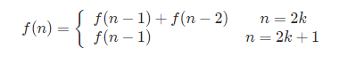

# 动态规划 #

---

[toc]

---

---

## 算法介绍 ##

> Dynamic Programming: 一种算法思想, 即 若要求解一个给定问题, 我们需要解其不同部分(即子问题), 再根据子问题的解得出原问题的解

### 1 基本要求 ###

​	应用动态规划求解的题目, 对解决问题的可行性即, 子问题与子问题和子问题和原问题之间的关系 存在着要求, 分别对应了 *最优子结构* 和 *重复子问题* 两点

#### 1.1 最优子结构 ###

> 规定了子问题和原问题的关系

##### 1.1.1 最优子结构

DP算法求解的是一类需要得到最优解或者是唯一可行解的问题

- 则: 如果一个问题的最优解(或唯一解) 是由其各个子问题的最优解(或唯一解)决定的, 那么这个时候可以考虑用DP
- 而构成这一类子问题的结构, 我们称为最优子结构

##### 1.1.2 状态转移方程 #####

在选定了最优子结构的情况下, 原问题和子问题的关系即被确定

例如, 在某个问题中, 关系可以用以下方程组来确定:

我们把```f(n)```称为 *n* 的状态, 这个方程描述的就是状态不断向当前转移的过程

- 我们可以根据 *最优子结构* 写出 *状态转移方程*
- 通过 *状态转移方程* 写出问题的 递归实现方法

#### 1.2 重复子问题 ####

> 重复子问题规定的是子问题与子问题的关系

当我们在递归地寻找每个子问题的最优解的时候，有可能会会重复地遇到一些更小的子问题，而且这些子问题会重叠地出现在子问题里，出现这样的情况，会有很多重复的计算，动态规划可以保证每个重叠的子问题只会被求解一次。当重复的问题很多的时候，动态规划可以减少很多重复的计算

### 2 核心步骤 ###

- 证明问题的方案中包含一种选择，选择之后留下一个或多个子问题
- 设计子问题的递归描述方式
- 证明对原问题的最优解包括了对所有子问题的最优解
- 证明子问题是重叠的（这一步不是动态规划正确性必需的，但是如果子问题无重叠，则效率与一般递归是相同的）

### 3 区别于递归 ###

​	通俗一点来讲，动态规划和其它遍历算法（如深/广度优先搜索）都是将原问题拆成多个子问题然后求解，他们之间最本质的区别是，动态规划保存子问题的解，避免重复计算。

​	解决动态规划问题的关键是找到状态转移方程，这样我们可以通过计算和储存子问题的解来求解最终问题。

​	特别的,在一些情况下，动态规划可以看成是带有状态记录（memoization）的优先搜索。状态记录的意思为，如果一个子问题在优先搜索时已经计算过一次，我们可以把它的结果储存下来，之后遍历到该子问题的时候可以直接返回储存的结果。

- 动态规划是自下而上的，即先解决子问题，再解决父问题；
- 而用带有状态记录的优先搜索是自上而下的，即从父问题搜索到子问题，若重复搜索到同一个子问题则进行状态记录，防止重复计算。
- 如果题目需求的是最终状态，那么使用动态搜索比较方便；如果题目需要输出所有的路径，那么使用带有状态记录的优先搜索会比较方便。

### 4 区别于贪心 ###


---

## 求解技巧 ##

### 1. 如何减小问题的规模 ###

- 线性
    - 每次减少一半
    - 每次减少一个
- 区间
- 树形
- 状态压缩

---

