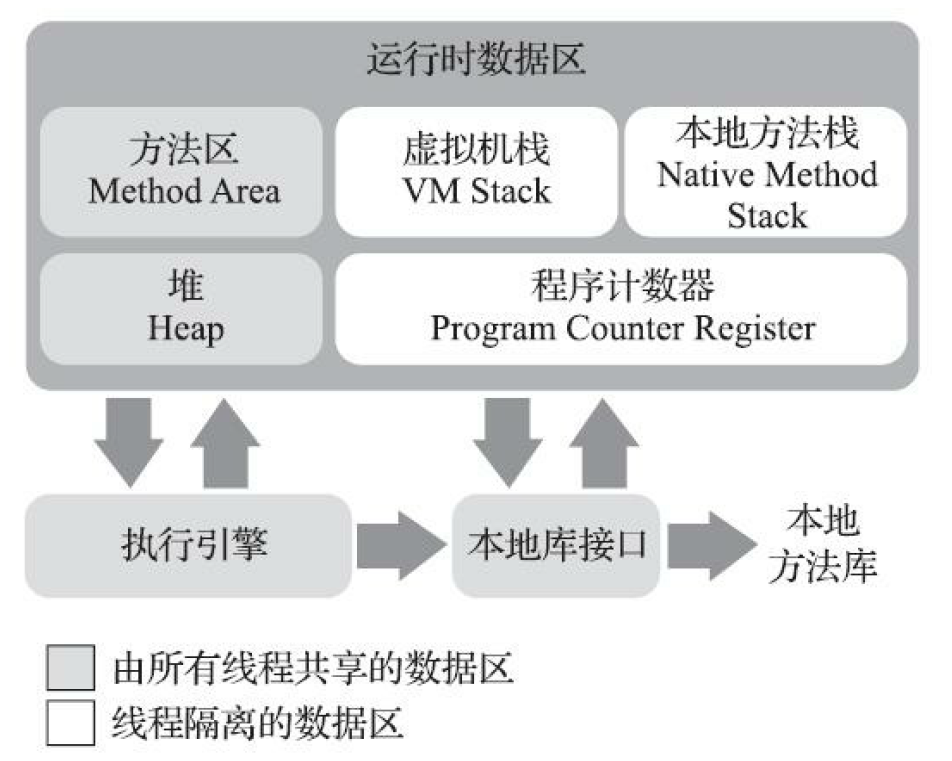

# Java内存区域与内存溢出异常 #

[toc]

---

---


## 1 运行时数据区域 ##

​	JVM在执行Java程序的过程中会把管理的内存划分为若干个不同的数据区域

> 不同的数据区域具有不同的 **用途** 、**创建** 和 **销毁时间**
>
> - 有些区域随着虚拟机进程的启动而一直存在
> - 有些区域则依赖用户线程的启动和结束而建立与销毁

JVM管理的区域如下图：



---

### 1.1 程序计数器 ###

​	**程序计数器(Program Counter Register)** 是一块较小的内存空间，可以看作是当前线程所执行的字节码的行号指示器。

> 由于JVM的多线程是通过线程的轮流切换、分配处理器执行时间的方式来实现的，在任何一个确定的时刻，一个处理器只会执行一条线程中的指令。
>
> 因此，为了线程切换后能恢复到正确的执行位置，每条线程需要一个独立的程序计数器，各条线程之间的程序计数器互不影响，独立存储。
>
> 所以，**PCR** 必须设置为 “线程私有” 的内存。

- 如果线程正在执行一个 *Java方法*，*PCR* 记录的是正在执行的JVM字节码指令的地址
- 如果线程正在执行一个 *本地(Native)方法*， *PCR* 值为**空(Undefined)**

> **PCR** 是《JVM规范》中唯一没有规定任何OOM[^1]情况的区域

---

### 1.2 Java虚拟机栈 ###

​	**Java虚拟机栈(JVM Stack)** 描述的是Java方法执行的线程内存模型：

- 每个方法被执行的时候，Java虚拟机都会同步创建一个 **栈帧(Stack Frame)**，用于存储局部变量表、操作数栈、动态连接、方法出口等信息。
- 每个方法从调用到执行完毕的过程吗，对应一个 **栈帧(Stack Frame)**， 在虚拟机栈中从入栈到出栈的过程。

> **JVM Stack** 由《JVM规范中》规定了两类异常：
>
> - 线程请求的栈深度大于**JVM Stack**所允许的深度，抛出SOF[^2]异常
> - 如果**JVM Stack**支持容量动态扩展，当栈扩展是无法申请到足够的内存会抛出OOM异常
>     - 特别的，对于**HotSpotVM**，栈容量不能动态扩展，所以只要成功申请了栈空间就不会出现OOM异常，但如果申请时失败，仍会出现OOM异常

---

### 1.3 本地方法栈 ###

​	**本地方法栈(Native Method Stack)** 与 JVM Stack发挥的作用类似，唯一的其区别在于：

- JVM Stack 为Java方法（亦即字节码）服务
- Native Method Stack 为虚拟机使用到的本地方法[^3]服务

> 异常情况同上
>
> HotSpot虚拟机将JVM Stack和Native Method Stack融合实现

---

### 1.4 Java堆 ###

​	**Java堆(Java Heap)**：

- JVM所管理的内存中最大的一块
- 所有线程共享的一块内存区域
    - 为了更好的回收内存，可以划分出多个**线程私有的分配缓冲区(Thread Local Allocation Buffer, TLAB)**
- 在虚拟机启动时创建
- 唯一用途是存放对象实例
    - 几乎所有对象实例及数组都应当在堆上进行分配
    - 从实现的角度来看，随着即时编译技术的进步（逃逸分析技术、栈上分配、标量替换等手段），出现不在堆上分配的对象实例

- 垃圾收集器所管理的区域（详见GC相关笔记）

> 主流的JVM都将Java Heap实现为可扩展的（通过参数-Xmx和-Xms）实现，因此：
>
> - Java Heap不要求物理上连续，但是在逻辑上视为连续的
> - 在Java Heap中没有内存完成实例分配，并且堆也无法在扩展时，会抛出OOM异常

---

### 1.5 方法区 ###

​	**方法区(Method Area)** ：

- 所有线程共享的一块内存区域
- 用于存储已被虚拟机加载的类型信息、常量、静态变量、即时编译器编译后的代码缓存等数据。

> 《JVM规范》对 Method Area的约束十分宽松：
>
> - 和Java heap一样不需要连续的内存，可以选择固定大小或可扩展
> - 可以选择不实现GC
> - 当Method Area无法满足新的内存分配需求时，将抛出OOM异常

---

### 1.x 直接内存 ###

​	**直接内存(Direct Memory)** 不是虚拟机运行时数据区的一部分，也不是《JVM规范》中定义的内存区域，但

- 使用非常频繁，在某些场景下可大幅提升性能
    - JDK 1.4 引入了 NIO类，可以使用Native函数库直接分配堆外内存，任何通过一个存储在Java Heap中的DirectByteBuffer对象作为这块内存的引用进行操作，避免在Java堆和Native堆中来回复制数据

- 在配置JVM参数时，如果忽略了Direct Memory，可能会导致OOM异常

---

---

## 2 以HotSpot VM为例分析Java Heap ##

---

### 2.1 对象的创建 ###

对象的创建过程如下：

1. JVM遇到一条字节码new指令

    1. 检查这个指令的参数能否在常量池中断定位到一个类的符合引用
    2. 检查这个符合引用代表的类是否已被加载、解析和初始化（如果没有，先执行相应的类加载过程）

2. 为新生对象分配内存

    所需内存大小在类加载完成后即可确定，因此，分配内存就是将一块确定大小的内存块从Java Heap中划分出来

    划分方法由两种，取决于内存是否规整：

    - 指针碰撞
        - Java Heap中的内存时规整的时候使用
        - 所有被使用过的内存被放在一侧，空闲的内存被放在另一侧，中间放置一个指针作为分界点指示器。分配内存时，将指示器向空闲方向移动一段与对象大小相等的距离
        - 使用Serial、ParNew等带压缩整理过程的收集器时，内存规整，使用这一方法
    - 空闲列表
        - Java Heap的内存不规则，使用过的内存和空闲内存交错时使用
        - 虚拟机维护一个列表，记录可用的内存块，分配内存时，从列表中找到一块足够大的空间划分给对象实例，并更新列表
        - 使用CMS等基于清除算法的收集器时，内存不规则，使用这一方法

    > 特别的，在划分内存时还需要考虑并发的问题：
    >
    > - 方案一：对分配内存的动作进行同步处理，实质上是JVM采用 *CAS+失败重试* 的方式保证更新操作的原子性
    > - 方案二：使用TLAB，只有一个线程的TLAB使用完的情况下才启用方案一

3. JVM将分配到的内存空间（除对象头以外）初始化为零值

    - 保障对象的实例字段可以在不赋初值的情况下使用
    - 如使用TLAB，这一步也可以提前到TLAB分配时进行

4. 对对象进行必要的设置

    - 实质上是对对象头进行设置
    - 主要包括：对象是哪个类的实例、类的元数据信息、对象的GC分代年龄等
    - 根据虚拟机当前的运行状态，存在不同的设置方式

5. 如果存在构造函数，执行构造函数

    - 是否存在这一步，由字节码流中，new指令后是否跟随invokespecial指令决定

---

### 2.2 对象的内存布局 ###

> 在HotSpotVM中，对象的存储布局可以划分为三个部分：对象头、实例数据和对齐填充

#### 2.2.1 对象头 ####

​	**对象头(Object Head)**包含两部分信息：

- 存储对象自身的 *运行时数据*
    - 包括：HashCode、GC分代、锁状态标志、线程持有的锁、偏向线程ID 等
    - 在32位和64位虚拟机中，这部分数据长度为32比特和64比特
    - 由于数据长度的限制，这类信息的数据结构是动态定义的，即在不同状态（例如不同锁定状态下），各类信息所占标志位是变化的，以充分利用空间
- 存储 *类型指针*
    - 即 对象指向其 *类型元数据* 的指针
        - 对于某些不经过对象本身查找对象元数据的方法，可以不保存这类信息
    - 如果对象是一个Java数组 还需要一块记录数组长度的数据

#### 2.2.2 实例数据 ####

​	**实例数据(Instance Data)**是对象存储的真正有效信息，任何被定义的字段（包括继承自父类或者子类自身定义的）都存储在这一部分

- 存储顺序受两方面共同影响：
    - 虚拟机分配策略参数(-XX:FieldsAllocationStyle)
        - HotSpotVM默认分配顺序为相同字宽分配到一起存放，字宽由长到短存放
        - 满足上述前提下，由父到子存放
        - 开启+XX:CompactFields参数，允许子类较短变量插入父类较长变量之间的空隙
    - 字段在Java源码中定义的顺序

#### 2.2.3 对齐填充 ####

​	**对齐填充(Padding)** 无实际意义，仅仅是占位符

- HotSpotVM要求对象起始地址必须为8字节的整数倍
    - *对象头* 已被设置好
    - *实例数据* 可能为对齐
    - *对齐填充* 该对象到最接近的8字节的整数倍大小

---

### 2.3 对象的访问定位 ###

​	《JVM规范》仅仅规定：Java程序通过Stack上的 *reference* 数据来操作Heap上的具体对象； *reference* 类型是一个指向对象的引用。并未定义这一引用应当如何访问，所以这依赖于虚拟机的具体实现，通常来说由以下两种方式：

#### 2.3.1 直接指针访问 ####

​	*reference* 中直接存储对象地址，由于Java Heap中的对象本身存放了 *类型数据（对象头中的类型指针）*，所以无需考虑如何访问类型数据

> 优势：速度更快，如果仅仅访问对象本身，节省了一次指针定位的开销

#### 2.3.2 句柄访问 ####

​	Java Heap划分一块内存作为 **句柄池**，句柄包含指向对象 *实例数据* 和 *类型数据*  的指针，*reference* 数据存储对象的句柄地址

> 优势：在对象被移动时（GC过程中，对象移动十分普遍）， *reference* 数据本身无需修改，只需要更改句柄中的实例指针

---

---

## 3 OutOfMemory异常分析 ##

> 根据《JVM规范》规定，除程序计数器外，虚拟机内存其他运行时区域都有可能出现OOM异常，下面分类总结

---

### 3.1 Java Heap溢出 ###

> 随着对象数量的增加，总容量触及最大堆的容量限制后会产生内存溢出异常

- 相关参数

    - -Xms：堆的最小值
    - -Xmx：堆的最大值（将最大值手动设置为和最小值相同可以避免堆的自动扩展）
    - -XX: +HeapDumpOnOutOF-MemoryError ：命令虚拟机在内存溢出异常的时候Dump出当前的 *内存堆转储快照* 以便分析

- 相关提示

    - ```java.lang.OutOfMemory : Java heap space```

- 解决办法

    - 打开 *内存映像分析工具* 对Dump得到的快照进行分析

    - 判断是**内存泄漏（Memory Leak）**或者**内存溢出（Memory Overflow）**，即导致OOM的对象是否必须存在

        > Leak：对象分配的内存一直被占用未被回收，但此时已经没有对该对象的引用，即该对象是非必要的
        >
        > Overflow：对一块内存写入超过其容量的数据
        >
        > 同：OOM异常，导致程序中断
        >
        > 异：Leak是Overflow的一种原因，持续的Leak可能导致Overflow

        - **Leak**：通过工具查看 *该对象到GC Roots的引用链* ，定位泄露代码的位置，完善代码
        - **Overflow**：
            - 检查JVM的堆参数设置，看看能否增加内存
            - 从代码检查，看看能否通过 *缩短对象的生命周期* 或 *改善存储结构设计* 来减少程序的运行内存消耗

### 3.2 JVM Stack和Native Method Stack 溢出 ###

- 异常分析：

    - 线程请求的栈深度大于虚拟机允许的最大栈深度：将抛出```java.lang.StackOverflow```异常
    - 如果虚拟机的栈内存允许动态扩展，当扩展栈容量无法申请到最够内存时，将抛出```java.lang.OutOfMemory```异常

    > 对于无法动态扩展容量的VM来说，当且仅当在线程运行前申请栈内存失败会抛出OOM异常，在线程运行的过程中，只可能出现SOF异常

- 原因分析（以无法动态扩容为例）：

    - OOM
        - 操作系统分配给每个进程的内存时有限制的。除了栈内存意外的内存是一定的或者可以设置最大值的，所以栈内存的分配取决于其他区域的内存
        - 栈内存是线程私有的，所以线程数量和每个线程分到的栈内存成反比
        - 因此，在不断增加线程或者给线程申请的内存过大的情况下，会出现OOM异常
    - SOF
        1. 调用了无法尾递归优化的递归，导致方法栈帧数过大
        2. 建立了过多线程，可能会看到```unable to create native thread```

- 解决方法：(一般来说栈帧超过深度的情况较少，主要考虑其他情况)

    - 减少线程数量或更换64位虚拟机
    - 减小最大堆容量
    - 减小栈容量

---

---

注释

[^1]: OutOfMemoryError 下同
[^2]: StackOverflowError 下同
[^3]: 写在JVM而不是JAVA程序中的方法