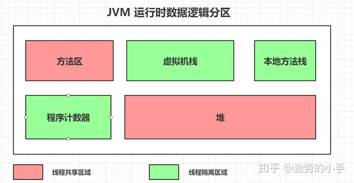
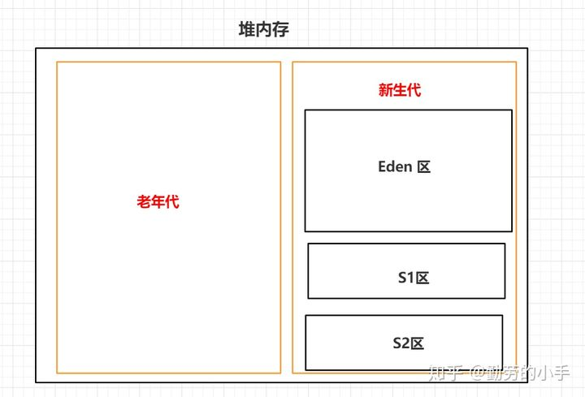
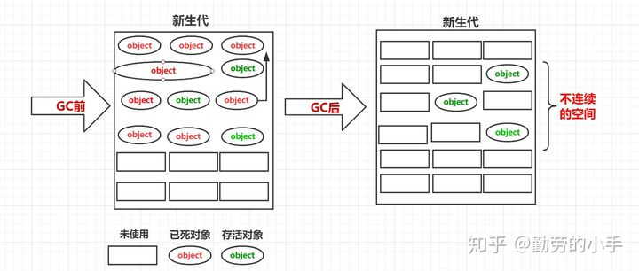
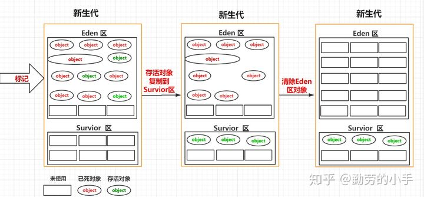

# JVM笔记 #

---

[toc]

---

---

## JVM ##

---

### JAVA虚拟机的作用 ###

> - 解释运行字节码程序
> - 消除平台相关性

- JVM 将 JAVA 字节码解释为具体平台的具体指令
- 一般高级语言在不同平台上运行, 至少需要编译成不同目标代码, 而JVM屏蔽了具体平台相关的信息, 使得Java语言编译程序只需要生成在JVM上运行的目标代码(字节码), 就可以在多种平台上不加修改的运行

---

---

## JVM 分区 ##

---

### JVM的内存模型 ###




| 名称       | 作用                                                         | 线程私有 |
| ---------- | ------------------------------------------------------------ | -------- |
| 方法区     | 用于保存已经被虚拟机加载的类元信息, 运行时常量信息, 字符串常量信息 | 否       |
| 栈         | 用于线程运行方法<br>        每一个线程创建后都会申请一个自己单独的栈空间<br>        每一个方法调用都会对应一个栈帧, 调用方法的过程就是一个压栈和出栈的过程<br>                栈帧中存储: 方法的局部变量表, 操作数栈, 动态连接, 方法的返回地址 | 是       |
| 本地方法栈 | 在JAVA程序需要与操作系统或者底层硬件交换信息时, 需要调用native方法, 调用本地方法时构建的方法栈 | 是       |
| 程序计数器 | 一块较小的内存空间<br>记录某个线程当前执行指令的位置         | 是       |
| 堆         | 虚拟机启动时创建<br>主要用来存放创建的对象数据               | 否       |

---

### JAVA堆模型 ###



- **新生代 和 老年代**

    - 堆内存主要用来存放运行过程中创建的对象数据, 根据对象存活的时间长短特性, 在逻辑上分为 新生代 和 老年代

        对于JVM而言, 绝大部分对象数据都是短暂存在的, 随方法调用而创建, 方法结束而消亡, 只有少部分对象堆长久的留在JVM内存中

    - 对于新创建堆对象, 我们放在新生代中

    - 只有经历了一定次数GC但是还未被回收的对象, 才会被认为可能长时间存在, 才会被转移到老年代中

        

- **Eden区 和  Survivor区**

    ​	

    - 为了减少GC后的空间碎片, 我们将新生代 划分为 Eden区 和Survivor区

    - 不划分时, 如图一, 新生代中 未被 GC 的对象会将内存分割为一堆不连续的空间

    - 划分后, 对象只在Eden区出生, 每次GC后, 都会将存活的对象, 从Eden区转移到Survivor区, 再清理Eden区, 这样我们就能得到一片连续的Eden区内存

        

- **S1 和 S2**

    - 同样, 就算Survivor区较小, 但是依然会存在 GC 后空间碎片的问题, 因此, 将Survivor区划分为S1 和 S2 两个部分
    - 例如, 我们把Eden S1 S2 的大小设置为 8 : 1 : 1
        - 对象在Eden中出生; 第一次GC,幸存者转移到S1, 清理Eden ,此时 S2 为空
        - Eden中再次产生新的对象, 第二次GC 将Eden区中幸存的对象和S1中的对象 转移到S2中, 清理Eden和S1, 对调From 和 To 的逻辑关系
    - 保证每次使用Survivor区时候, 都有一片连续的空白区域可供使用
    - *代价*
        - 复制对象的开销
        - 10%的空间浪费

---

---

## GC ##

---

### 什么是GC, 为什么要有GC, 能否主动GC ##

- GC 是 垃圾回收, 指回收程序中不再使用的内存

    

- 在程序设计过程中, 内存处理是复杂且重要的, 遗忘或者错误进行内存回收会导致程序或者系统的不稳定甚至崩溃

    JAVA 提供的垃圾回收机制 可以自动检测对象是否超出作用域 从而实现自动回收的目的

    GC使得Java开发人员摆脱了繁琐的内存管理工作，让程序的开发更有效率

    

- JAVA不支持显式的释放某个对象的内存, 只有在虚拟机空闲或者当前内存不足的情况下, 才会触发执行

    编程人员可以手动执行```System.gc()```, 但是JAVA语言规范只保证虚拟机接到这一通知, 不保证GC一定会执行

---

### 常见的GC算法有哪些 ###

> 常见的GC算法有两大类, 一类是Reference Counting GC(引用计数GC), 另一类是Tracing GC(追踪式GC)
>
> 在一部分文献中, 这两类算法也被分别称为 直接GC 和 间接GC
>
> 主流的JVM 一般不采用 引用计数GC, 所以下面简单谈一下, 主要谈 Tracing GC


**直接GC**

- 基本算法 :
    -  在对象中添加一个引用计数器,
    -  每有一个地方引用了这个对象时, 计数器加一; 引用失效时, 计数器减一
    - 计数器归零时, 我们认为这个对象不会再被引用
- 缺陷:
    - 单纯的引用计数算法, 无法解决对象之间循环引用的问题, 必须配合大量的额外处理


**间接GC **

[可达性分析算法]()

---

### JVM如何判断对象需要回收 ##

---

### JVM中, 什么可以作为GC ROOT ###

---

### 常见的GC收集器有哪些? ###

---

---

## 类加载 ##

---

### 简单介绍JVM的类加载机制 ###

