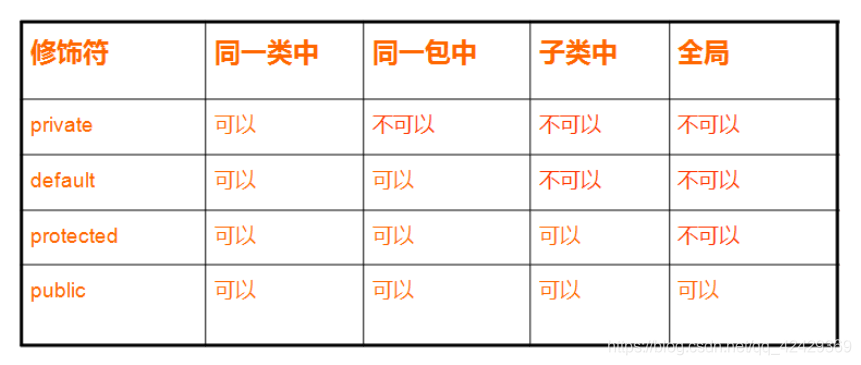

# 面向对象 #

---

[toc]

---

### 面向对象的基本特性有哪些 ###

1. **抽象** : 将一类对象的共同特征总结出来构造类的过程, 抽象只关注对象的某些属性或行为, 但是不关注行为的细节
2. **封装** : 将对象的某些字段或者方法设置为私有的，不能被外界访问，以此实现对数据和代码不同级别的访问权限。防止了程序相互依赖性而带来的变动影响, 实现了对数据和行为的包装和信息隐藏
3. **继承** : 继承的基本思想就是, 基于已有的类创建新的类, 继承已存在的类就是复用这些类的属性或者方法,同时增加新的方法和字段, 使新类可以满足新的情况
4. **多态** : 指为不同的数据类型的实体,提供统一的外部接口, 在接受到不同消息时, 表现出不同的结果

---

### Java控制访问 ###

---

### 重载 和 重写的区别 ###

**重载(Overloading)**

---

### Java是否可以重写一个Static方法 ##

---

### Object类的常用方法 ###

- Object() : 默认构造方法
- clone(): 创建并返回此对象的一个副本
- equals(Object obj) :  指示某个其他对象是否与此对象 "相等"
- finalize() : 当垃圾回收器确定不存在对该对象的跟多引用时, 由对象的垃圾回收期调用这个方法
- getClass() : 返回一个对象的运行时类
- hashCode() : 返回该对象的哈希值
- notify() / notifyAll() : 唤醒此对象监视器上等待的 单个线程/所有线程
- wait() : 当前线程等待, 直到被唤醒

---

