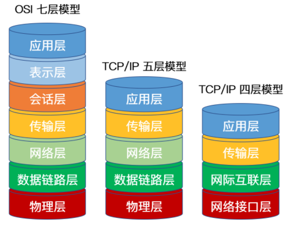
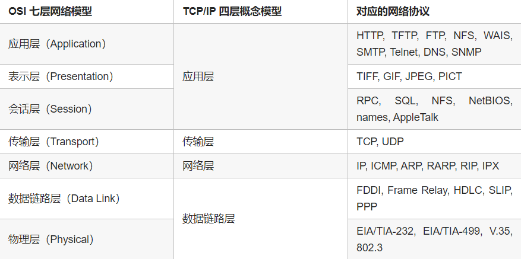

---

[toc]

---

---

## 协议分层及服务类型 ##

---

### 什么是OSI七层模型 ###

> OSI模型 全程为 开放式通信系统互联参考模型
>
> - OSI 将计算机网络体系结构划分为七层
> - 每层实现各自的功能和协议
> - 每层仅仅完成和相邻层的接口通信
> - OSI 的服务定义详细说明了各层所提供的服务
>     - 某一层的服务 就是 该层及其下各层的一种能力 通过接口提供给更高一层

1. 应用层
    - 作用是通过应用程序间的交互来完成特定的网络应用
    - 该层协议定义了应用进程之间的交互规则，通过不同的应用层协议为不同的网络应用提供服务
    - 如域名系统 DNS，支持万维网应用的 HTTP 协议，电子邮件系统采用的 SMTP 协议等
    - 在应用层交互的数据单元我们称之为报文
2. 表示层
    - 作用是使通信的应用程序能够解释交换数据的含义
    - 该层提供的服务主要包括数据压缩，数据加密以及数据描述
    - 这使得应用程序不必担心在各台计算机中表示和存储的内部格式差异
3. 会话层
    - 负责建立、管理和终止表示层实体之间的通信会话
    - 提供了数据交换的定界和同步功能
    - 包括了建立检查点和恢复方案的方法
4. 传输层
    - 主要任务是为两台主机进程之间的通信提供服务
    - 应用程序利用该服务传送应用层报文
        - 该服务并不针对某一特定的应用，多种应用可以使用同一个传输层服务
    - 由于一台主机可同时运行多个线程，因此传输层有复用和分用的功能
        - 复用就是指多个应用层进程可同时使用下面传输层的服务
        - 分用是传输层把收到的信息分别交付上面应用层中的相应进程
5. 网络层
    - 主要任务就是选择合适的网间路由和交换节点，确保数据按时成功传送
    - 网络层把传输层产生的报文或用户数据报封装成分组和包向下传输到数据链路层
    - 在网络层使用的协议是无连接的网际协议（Internet Protocol）和许多路由协议，因此我们通常把该层简单地称为 IP 层
6. 数据链路层
    - 两台主机之间的数据传输，总是在一段一段的链路上传送的，这就需要使用专门的链路层协议
    - 在两个相邻节点之间传送数据时，数据链路层将网络层交下来的 IP 数据报组装成帧，在两个相邻节点间的链路上传送帧
        - 每一帧包括数据和必要的控制信息
        - 通过控制信息我们可以知道一个帧的起止比特位置
        - 也能使接收端检测出所收到的帧有无差错
7. 物理层
    - 作用是实现计算机节点之间比特流的透明传送
    - 尽可能屏蔽掉具体传输介质和物理设备的差异,使其上面的数据链路层不必考虑网络的具体传输介质是什么
    - 该层的主要任务是确定与传输媒体的接口的一些特性（机械特性、电气特性、功能特性，过程特性）

---

### TCP/IP 参考模型 ###

1. 应用层
    - TCP/IP 模型将 OSI 参考模型中的会话层、表示层和应用层的功能合并到一个应用层实现
    - 过不同的应用层协议为不同的应用提供服务。例如：FTP、Telnet、DNS、SMTP 等
2. 传输层
    - 该层对应于 OSI 参考模型的传输层，为上层实体提供源端到对端主机的通信功能
    - 传输层定义了两个主要协议：传输控制协议（TCP）和用户数据报协议（UDP）
        - 面向连接的 TCP 协议保证了数据的传输可靠性
        - 面向无连接的 UDP 协议能够实现数据包简单、快速地传输
3. 网际互联层
    - 网际互联层对应 OSI 参考模型的网络层
    - 主要负责相同或不同网络中计算机之间的通信
    - 在网际互联层， IP 协议提供的是一个不可靠、无连接的数据报传递服务。该协议实现两个基本功能：寻址和分段
4. 网络接入层
    - 网络接入层的功能对应于 OSI 参考模型中的物理层和数据链路层
    - 负责监视数据在主机和网络之间的交换

> 拆开网络接入层就是五层参考模型, 使用较少, 仅作备注

---

### OSI 模型和 TCP/IP 模型异同 ###

| OSI                                                          | TCP/IP                                                       |
| ------------------------------------------------------------ | ------------------------------------------------------------ |
| 都采用了层次结构                                             |
| 都能够提供面向连接和无连接两种通信服务机制                   |
|                                                                                                                           |
| OSI 采用的七层模型                                           | TCP/IP 是四层结构                                            |
| OSI 参考模型对服务和协议做了明确的区分                       | TCP/IP 参考模型没有对网络接口层进行细分，只是一些概念性的描述 |
| OSI 先有模型，后有协议规范，适合于描述各种网络               | TCP/IP 是先有协议集然后建立模型，不适用于非 TCP/IP 网络      |
| OSI 一开始只强调面向连接服务，直到很晚才开始制定无连接的服务标准 | TCP/IP 一开始就提出面向连接和无连接服务                      |
| OSI 参考模型虽然被看好，但将网络划分为七层，实现起来较困难   | TCP/IP 参考模型虽然有许多不尽人意的地方，但作为一种简化的分层结构比较容易实现 |

---

### OSI 和 TCP/IP 协议之间的对应关系 ###

---

