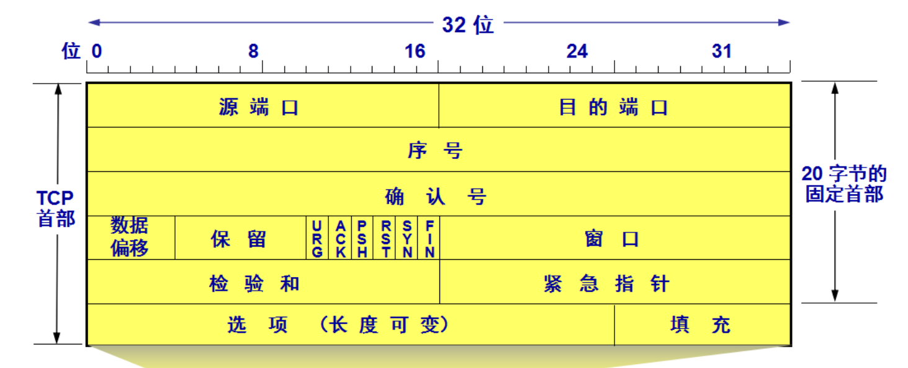
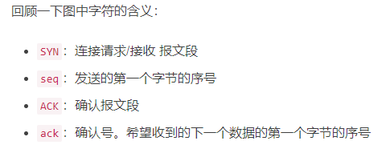
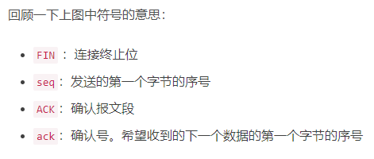

# 传输层 #

---

[toc]

---

## 三次握手 和 四次挥手 机制 ##

### TCP 报文段首部格式(仅作基础知识了解) ###

自上而下, 各字段意义如下:

-  **源端口和目的端口**：各占 2 个字节，分别写入源端口和目的端口。IP 地址 + 端口号就可以确定一个进程地址
- **序号/序列号（Sequense Number，SN）**：在一个 TCP 连接中传送的字节流中的每一个字节都按顺序编号。该字段表示本报文段所发送的数据的第一个字节的序号。初始序号称为 Init Sequense Number, ISN（序号/序列号这个字段很重要，留个印象，下文会详细讲解）
- **确认号 ack**：期望收到对方下一个报文段的第一个数据字节的序号。若确认号为 N，则表明：到序号 N-1 为止的所有数据都已正确收到
- **数据偏移**（首部长度）：它指出 TCP 报文段的数据起始处距离 TCP 报文段的起始处有多远。这个字段实际上是指出TCP报文段的首部长度
- **保留**：占 6 位，应置为 0，保留为今后使用

需要特别记住的是在保留字段后的六个控制位!!!

- **紧急位 URG**：
    - 当 URG = 1 时，表明此报文段中有紧急数据，是高优先级的数据，应尽快发送，不用在缓存中排队。该控制位需配合紧急指针使用（紧急指针指出本报文段中紧急数据的字节数）
    - 例如: 我们需要取消一个已经发送了很长程序的运行，因此用户从键盘发出中断命令, 如果不适用URG显然没有意义
- **确认 ACK**：
    - 区别于上述 *确认号 ack* 
    - 仅当 ACK = 1 时确认号字段才有效，当 ACK = 0 时确认号无效
    - TCP 规定，在连接建立后所有传送的报文段都必须把 ACK 置为 1
- **推送 PSH:**
    - 当两个应用进程进行交互式的通信时，有时在一端的应用进程希望在键入一个命令后立即就能收到对方的响应
    - 在这种情况下，TCP 就可以使用推送（push）操作
        - 这时，发送方 TCP 把 PSH 置为 1，并立即创建一个报文段发送出去
        - 接收方 TCP 收到 PSH = 1 的报文段，就尽快地交付接收应用进程。而不用等到整个缓存都填满了后再向上交付
- **复位 RST**：
    - 当 RST = 1 时，表明 TCP 连接中出现了严重错误（如由于主机崩溃或其他原因），必须释放连接，然后再重新建立传输连接
- **同步 SYN**：
    - SYN = 1 表示这是一个 连接请求 或 连接接受 报文。
    - 当 SYN = 1 而 ACK = 0 时，表明这是一个连接请求报文段
        - 对方若同意建立连接，则应在响应的报文段中使 SYN = 1 且 ACK =1 
- **终止 FIN**：
    - 用来释放一个连接。当 FIN = 1时，表明此报文段的发送发的数据已发送完毕，并要求释放运输连接

---

###  三次握手 过程详解 ###

> 在握手之前，主动打开连接的客户端结束 `CLOSED` 阶段
>
> 被动打开的服务器也结束 `CLOSED` 阶段，并进入 `LISTEN` 阶段：
>
> > `CLOSED`：没有任何连接状态
> >
> > `LISTEN`：侦听来自远方 TCP 端口的连接请求

**第一次握手：**

*客户端向服务器发送一个 `SYN` 包，并等待服务器确认*

报文内容:

- 标志位为 `SYN`, 设置`SYN=1`表示请求建立连接
- 序列号为 `Seq = x` , 表示本报文段所发送的数据的第一个字节的序号（一般为 1）

> 随后, 客户端进入 `SYN_SENT` 状态
>
> > `SYN-SENT` ：在发送连接请求后等待匹配的连接请求

**第二次握手**

*服务器接收到客户端发来的 SYN 包后，对该包进行确认后结束 LISTEN 阶段，并返回一段 TCP 报文*

报文内容:

- 标志位为 SYN 和 ACK, 表示确认客户端的报文 Seq 序号有效，服务器能正常接收客户端发送的数据，并同意创建新连接
- 序号为 Seq = y
- 确认号为 Ack = x + 1，表示收到客户端的序号 Seq , 并将其值加 1 作为自己确认号 Ack 的值

> 随后, 服务器进入 `SYN_REVD` 的状态。
>
> > `SYN-RECEIVED`：在收到和发送一个连接请求后等待对连接请求的确认

**第三次握手**

*客户端接收到发送的 SYN + ACK 包后，明确了从客户端到服务器的数据传输是正常的，从而结束 SYN-SENT 阶段。并返回最后一段报文*

报文内容:

- 标志位为 ACK，表示确认收到服务器端同意连接的信号
- 序号为 Seq = x + 1，表示收到服务器端的确认号 Ack，并将其值作为自己的序号值
- 确认号为 Ack= y + 1，表示收到服务器端序号 seq，并将其值加 1 作为自己的确认号 Ack 的值

> 随后, 客户端进入 `Establised` 状态
>
> > `ESTABLISHED`：代表一个打开的连接，数据可以传送
>
> 最后, 服务器收到 ACK 报文之后，也进入 `Establised 状态`

---

###  四次挥手 过程详解 ###

>TCP 连接的释放需要发送四个包（执行四个步骤），因此称为四次挥手(`Four-way handshake`)，**客户端或服务端均可主动发起挥手动作**
>
>刚开始双方都处于`ESTABLISHED` 状态，假设是客户端先发起关闭请求

**第一次挥手**

*客户端向服务器发送一段 TCP 报文表明其想要释放 TCP 连接*

报文内容:

- 标记位为 FIN，表示请求释放连接
- 序号为 Seq = u

> 随后,客户端进入 `FIN_WAIT1` 状态
>
> > `FIN-WAIT-1` -  等待远程TCP的连接中断请求，或先前的连接中断请求的确认

**第二次挥手**

*服务器接收到客户端请求断开连接的 FIN 报文后，结束 ESTABLISHED 阶段，进入 CLOSE-WAIT 阶段并返回一段 TCP 报文*

报文内容:

- 标记位为 ACK，表示接收到客户端释放连接的请求
- 序号为 Seq = v
- 确认号为 Ack = u + 1，表示是在收到客户端报文的基础上，将其序号值加 1 作为本段报文确认号 Ack 的值

> 此时 *服务端* 处于 `CLOSE_WAIT` 状态
>
> > `CLOSE-WAIT` - 等待从本地用户发来的连接中断请求
>
> 客户端收到服务端确认后，*客户端* 进入`FIN_WAIT2`（终止等待 2）状态, 等待服务端发出的连接释放报文段
>
> > `FIN-WAIT-2` - 从远程TCP等待连接中断请求

**第三次挥手**

*服务器端在发出 ACK 确认报文后，服务器端会将遗留的待传数据传送给客户端*

*待传输完成后(即完成了CLOSE-WAIT 阶段)，便做好了释放服务器端到客户端的连接准备，再次向客户端发出一段 TCP 报文*

报文内容:

- 标记位为 FIN 和 ACK，表示已经准备好释放连接了
- 序号为 Seq = w
- 确认号 Ack = u + 1，表示是在收到客户端报文的基础上，将其序号 Seq 的值加 1 作为本段报文确认号 Ack 的值。

> 随后, 服务端进入 `LAST_ACK` 的状态，停止向客户端发送数据, 等待客户端的确认
>
> > `LAST-ACK` - 等待原来发向远程TCP的连接中断请求的确认

**第四次挥手**

*客户端收到从服务器发来的 TCP 报文，确认了服务器已经做好释放连接的准备，于是结束 FIN-WAIT-2 阶段，进入 TIME-WAIT 阶段，并向服务器发送一段报文*

报文内容:

- 标记位为 ACK，表示接收到服务器准备好释放连接的信号
- 序号为 Seq= u + 1，表示是在已收到服务器报文的基础上，将其确认号 Ack 值作为本段序号的值
- 确认号为 Ack= w + 1，表示是在收到了服务器报文的基础上，将其序号 Seq 的值作为本段报文确认号的值

> 客户端进入 **`TIME_WAIT` （计时等待）状态**, 等待2MSL后进入CLOSED阶段
>
> > `TIME-WAIT` - 等待足够的时间以确保远程TCP接收到连接中断请求的确认
>
> 服务器端收到从客户端发出的 TCP 报文之后结束 LAST-ACK 阶段，进入 CLOSED 阶段

---

---

## 三次握手 相关问题 ##

---

### 如果三次握手的过程中, 信息未收到会怎么样处理 ###

| 次数       | 报文                                            | 客户端                                                       | 服务端                                                       |
| ---------- | ----------------------------------------------- | ------------------------------------------------------------ | ------------------------------------------------------------ |
| 第一次握手 | 客户端 发给 服务端 请求建立连接 的 `SYN`报文 | 1.等待一段时间后重发 2.重复这一过程直到发送次数达到最大重传限制 3.向建立连接的系统调用返回-1 | 无动作                                                       |
| 第二次握手 | 服务端 发给 客户端 回应的 `ACK`报文          | 客户端并不知道是不是第一次握手的报文未被接受 所以会采取第一次握手失败的动作 | 阻塞在`accept()`系统调用处,等待客户端发送 `ACK`报文          |
| 第三次握手 | 客户端 发给 服务端 回应的 `ACK`报文          | 认为自己建立连接成功                                         | 1.采用类似的超时重传机制 2.达到最大次数后, `accept()`系统调用返回-1, 服务端连接建立失败 3.客户端并不知道是否失败, 所以会继续发送数据,    因此, 接收到客户端后续数据后, 会发送`RST`报文告知客户端, 连接建立失败      消除客户端单方面建立的连接 |

---

### 为什么要进行三次握手, 两次不行吗 ###

网络往往是非理想状态的（存在丢包和延迟）, 每一次握手都是对双端发送能力和接受能力的确认, 只有经过三次握手, 双端才能分别确认另一端能否正常的接受到自己发送的数据

|            | 客户端                                                       | 服务端                           |
| ---------- | ------------------------------------------------------------ | -------------------------------- |
| 第一次握手 |                                                              | 客户端发送正常 服务端接受正常 |
| 第二次握手 | 客户端发送正常, 客户端接受正常,  服务端接受正常, 服务端发送正常 |                                  |
| 第三次握手 |                                                              | 客户端接受正常 服务端发送正常 |

如果没有第三次握手

​	服务端无法确认自己发送的数据是否可以被客户端接受

​	假定我们采取的策略是: 服务端始终认为自己发送的数据可以被客户端接受

​	在无法正常接受的情况下, 可能会出现如下情况

- 客户端发送`SYN`报文请求建立连接, 服务端返回一个`ACK`报文, 此时服务端此时就建立了连接

- 客户端未能收到报文, 但无法确认是自己的发送能力问题还是服务端的接受能力问题, 于是并未建立连接,而是开始重传

- 重传超时, 客户端发送新的创建连接请求

- 由于服务端认为上一个连接已经成功建立, 那么对于这个新的请求, 服务端会重新开启一段新的端口进行连接

    极端情况下, 可能会出现有大量端口被开启, 但是没有连接成功建立, 造成巨大的系统开销

---

### 第二次握手, 传回了ACK, 为什么还要传回 SYN ###

​	ACK和SYN是合并为一个报文段发送的，由服务端发送给客户端

- *ACK(Acknowledgement)* : 确认字符
    - 在数据通信传输中，接收站发给发送站的一种传输控制字符,它表示确认发来的数据已经接受无误
- SYN : 是在建立连接时用到的同步请求
    - 接收方（服务器）在第二次握手的时候回传SYN是证明双方之间通信的通道没有问题，我收到的信息确实是你（客户端）发送的信号

---

---

## 四次挥手 相关问题 ##

---

### 为什么要进行第四次挥手 ###

​	释放 TCP 连接时之所以需要四次挥手，是因为 *ACK 确认接收报文* 和  *FIN 释放连接报文* 是分别在两次握手中传输的。

> 即我们不能用一条报文传输ACK 和 FIN, 原因如下:

- 当主动方在数据传送结束后发出连接释放的通知，由于被动方可能还有必要的数据要处理，所以会先返回 ACK 确认收到报文

- 当被动方也没有数据再发送的时候，则发出连接释放通知，对方确认后才完全关闭TCP连接

---

### 为什么有 CLOSE-WAIT 状态 和 TIME-WAIT状态, 而不是直接关闭 ###

**CLOSE-WAIT**

​	在服务器收到客户端关闭连接的请求(收到FIN报文)并告诉客户端自己已经成功收到了该请求(发出ACK报文)之后

​	服务器进入了 CLOSE-WAIT 状态，然而此时有可能服务端还有一些数据没有传输完成，因此不能立即关闭连接

​	而 CLOSE-WAIT 状态就是为了保证服务器在关闭连接之前将待发送的数据发送完成

**TIME-WAIT**

​	当客户端收到服务端关闭连接的请求(收到FIN报文) 并向服务端发送 ACK 确认报文后

​	客户端进入TIME-WAIT状态, 而不是直接进入CLOSE状态

​	假定取消这个状态, 可能会出现如下两种情况:

1. 此时, 服务端的相应端口还未关闭, 客户端在相同端口建立新的连接可能收到上一次连接残留的数据包, 引起未知错误
2. 服务端未收到客户端的ACK报文, 启用重传机制, 重新向客户端发送FIN报文, 而客户端此时是关闭的, 所以会用RST报文进行响应, 导致误以为连接未正常关闭

---

### TIME-WAIT 为什么是 2MSL ###

> MSL（Maximum Segment Lifetime），指一段 TCP **报文在传输过程中的最大生命周期**

​	当客户端发出最后的 ACK 确认报文时，并不能确定服务器端能够收到该段报文。所以客户端在发送完 ACK 确认报文之后，会设置一个时长为 2 MSL 的计时器

- 若服务器在 1 MSL 内没有收到客户端发出的 ACK 确认报文，再次向客户端发出 FIN 报文
    - 如果客户端在 2 MSL 内收到了服务器再次发来的 FIN 报文，说明服务器由于一些原因并没有收到客户端发出的 ACK 确认报文
    - 客户端将再次向服务器发出 ACK 确认报文，并重新开始 2 MSL 的计时
- 若客户端在 2MSL 内没有再次收到服务器发送的 FIN 报文，则说明服务器正常接收到客户端 ACK 确认报文，客户端可以进入 CLOSE 阶段，即完成四次挥手

> 2 MSL 即是服务器端发出 FIN 报文和客户端发出的 ACK 确认报文所能保持有效的最大时长,
>
> 客户端要经历 2 MSL 时长的 TIME-WAIT 阶段，为的是确认服务器能否接收到客户端发出的 ACK 确认报文

---

---

## TCP协议 和 UDP协议 ##

---

